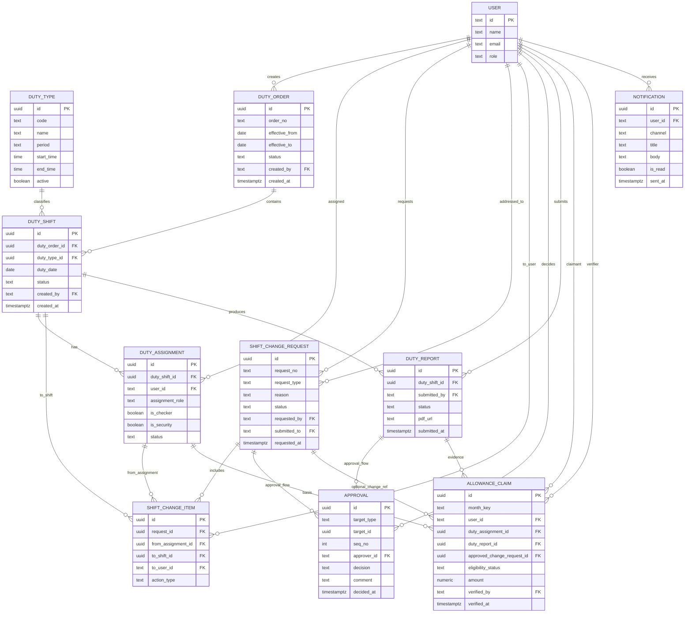

# ER Diagram: ระบบจัดการอยู่เวร

แผนภาพนี้สรุปจาก `duty_desc.md` และออกแบบให้เชื่อมกับตาราง `user` (Better Auth) ที่มีอยู่แล้วในโปรเจกต์

## หมายเหตุ mapping ตามเอกสาร
- `DUTY_TYPE.period`: `DAY` / `NIGHT` (รองรับ 3 ประเภทเวรตามเอกสาร)
- `DUTY_ASSIGNMENT.assignment_role`: `JUDGE` / `SUPERVISOR` / `OFFICER` / `SECURITY`
- `SHIFT_CHANGE_REQUEST.request_type`: `SWAP` / `MOVE` / `CANCEL`
- `APPROVAL.target_type`: `SHIFT_CHANGE_REQUEST` หรือ `DUTY_REPORT`
- เงื่อนไขธุรกิจ (เช่น คนตรวจเวรห้ามเป็นคนเดียวกับคนอยู่เวร, เวรชนเวรเบิกไม่ได้) ควรบังคับที่ service/server action + validation rule
